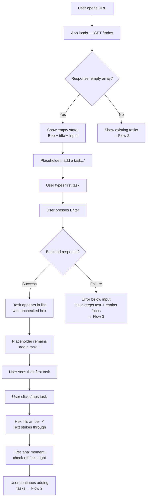
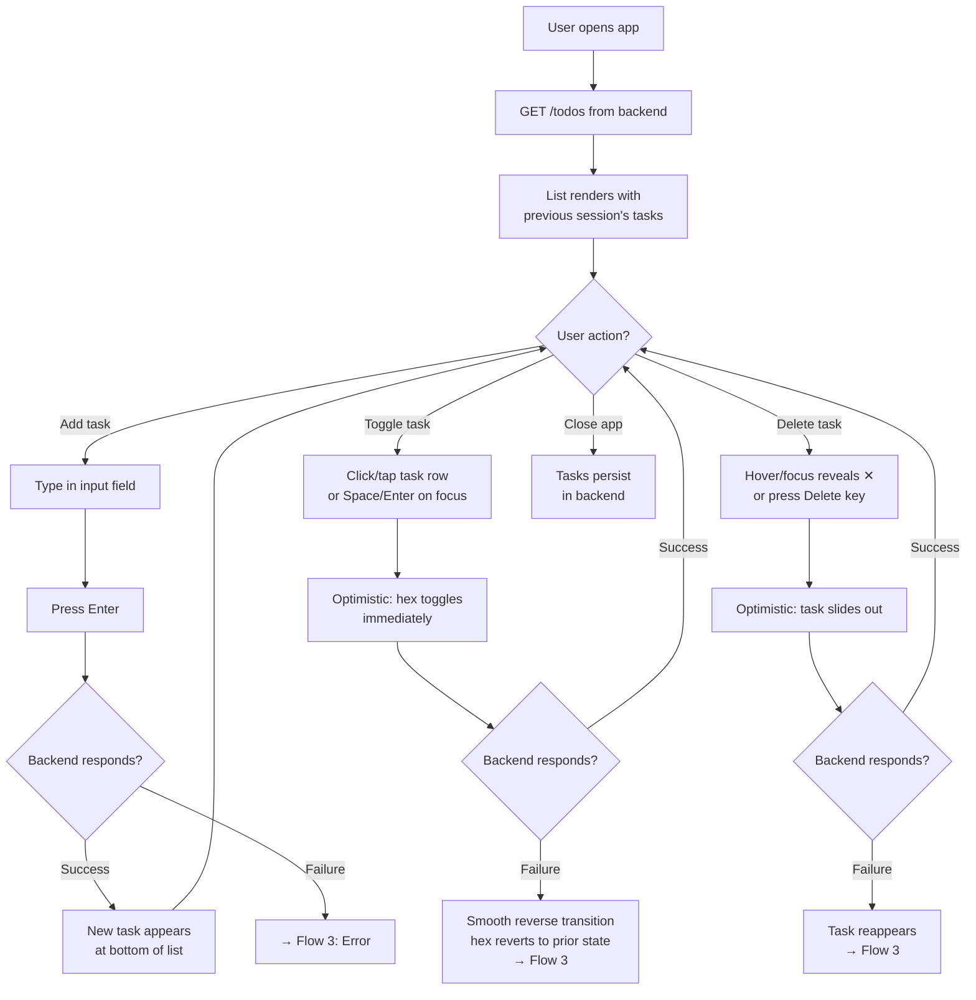
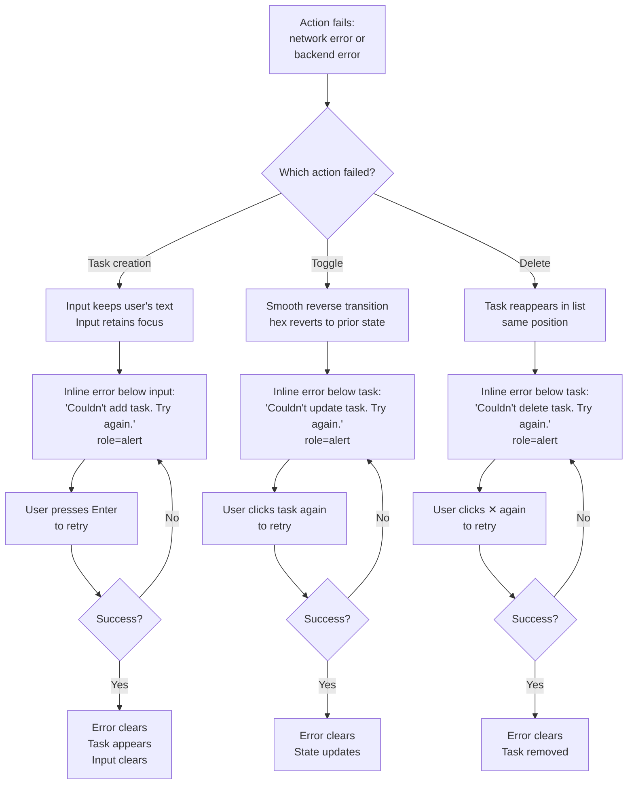

# UX Design Specification todo

**Author:** Carlene
**Date:** 2026-03-06

---

<!-- UX design content will be appended sequentially through collaborative workflow steps -->

## Executive Summary

### Project Vision

A personal task management web app that prioritises feel over feature count. The bumble bee theme — warm palette, cheerful character, satisfying micro-interactions — gives the product personality without complexity. The core loop is simple: add a task, do the thing, check it off. That check-off moment is the emotional centre of the product. No auth, no onboarding, no configuration. The app loads, the list is there, and the user is in control.

### Target Users

**Carlene (Daily Driver)** — Technical lead managing a busy day across desktop and mobile. Needs zero-friction task capture between meetings. Values speed, clarity, and the satisfaction of checking things off. Will not tolerate tools that become tasks themselves.

**Alex (Developer/Operator)** — Backend engineer evaluating, deploying, and extending the app. Needs conventional structure, clear README, and a small self-evident API. Success means understanding the codebase in under 20 minutes.

### Key Design Challenges

1. **Habit formation through interaction feel** — The completion moment is the product's return loop. If checking off a task doesn't feel satisfying, nothing else matters. The interaction quality of the toggle/checkbox is the single highest-priority UX problem to solve.
2. **Non-blocking, spatially-associated error states** — Errors must surface per-item, inline, near the action that failed. A colour indicator on the affected element plus a contextual icon (expandable for detail) that auto-clears on resolution. The pattern must work across viewports without blocking continued use. Open questions for interaction design: what does "fixed" mean per error type — auto-retry vs manual re-trigger for failed deletes, toggles, and creates.
3. **Wordless onboarding** — The empty state must teach the input affordance through a simple placeholder ("add a task..."), not instructional text. The interaction model must be self-evident on first contact.

### Design Opportunities

1. **The completion moment** — The tactile satisfaction of marking a task done is the product's signature interaction. Animation and visual feedback here create the emotional return loop.
2. **Empty state as emotional moment (post-MVP)** — MVP uses a single ghost-task placeholder for all empty states. Post-MVP: distinguish "fresh start" from "all clear" with reactive bee personality — aligned with PRD Vision items (loop-de-loop animation, celebration state). The bee evolves from static mascot to reactive companion.
3. **Bee as brand, not feature** — The static bumble bee and themed palette create warmth and memorability at zero interaction cost. The bee sits at the top, sets the tone, and stays out of the way.
4. **Touch-first satisfaction** — A simple single-list CRUD app is ideal for mobile. Generous tap targets and responsive feedback can make this feel better on a phone than most native alternatives.

### Error Pattern Principle

**Spatial proximity as error communication.** Errors live where they happened: icon next to the checkbox means toggle failed, icon next to the delete button means delete failed, icon next to the input means create failed. Users build a mental model through spatial association without explicit explanation. The pattern teaches itself through consistency and repetition.

## Core User Experience

### Defining Experience

The core experience is equal-weight CRUD — create, view, complete, and delete all receive equal design attention. No single action is elevated above the others for MVP. The product's value is the complete loop: add a task, see it in the list, mark it done, clear it when irrelevant. All four actions must feel equally smooth and responsive.

### Platform Strategy

- Web application, responsive across desktop and mobile with equal weight (Original PRD)
- No offline functionality for MVP
- No keyboard shortcuts beyond Enter to submit (FR11) — keyboard navigation is explicitly post-MVP per PRD
- No pagination or lazy loading for MVP — target is ~20 items rendering within 500ms. Note for architecture: data model and API should not preclude pagination in future.
- Touch-friendly controls on mobile with appropriately sized tap targets (Original PRD)

### Effortless Interactions

- **Task creation:** Type and hit Enter. Input field is always visible, always ready. No modal, no extra click to start adding. (Original PRD)
- **Task completion:** Single tap/click on a recognisable control (checkbox or equivalent). Completed tasks visually distinct from active at a glance. Reversible — completed tasks can be toggled back to incomplete. (Original PRD)
- **Task deletion:** Single action, no confirmation dialog. A deliberate delete is an intentional user action, not data loss. For a personal, low-stakes task list, speed of interaction wins over undo protection. (Original PRD + Carlene's explicit preference)
- **List visibility:** Full todo list renders immediately on load. No login, no setup, no loading gate. The list being there instantly is part of the product's identity, not just a performance metric. (Original PRD + Carlene's explicit emphasis)

### Critical Success Moments

1. **First load** — The list is there. Instantly. Yesterday's tasks waiting. This is the trust moment — data persisted, no login required. This moment is the product's identity. (Original PRD)
2. **First task added** — Type, Enter, it appears. Zero friction confirms the product works as expected. (Original PRD)
3. **First task completed** — Visual distinction confirms the action took. The user sees progress at a glance. (Original PRD)
4. **Error recovery** — When something fails, the user sees it clearly and can continue without being blocked. MVP: error message text displayed below the specific field/item that failed. (Original PRD)

### Experience Principles

1. **Equal attention to all core actions** — Create, complete, delete each deserve the same design care. No action is a second-class citizen. (Original PRD)
2. **Instant and present** — The list loads immediately, actions reflect instantly, no page reloads. The app feels like it's always been open. (Original PRD)
3. **Simplicity over safety nets** — No confirmation dialogs, no multi-step flows. Deliberate user actions are intentional, not accidental. Speed of interaction wins. (Carlene's explicit preference)
4. **Bee theme as visual warmth** — MVP scope: static bumble bee SVG at page top + bee-themed colour palette. No animated bee, no themed UI elements, no honeycomb patterns. The theme sets tone without adding complexity. (Carlene's explicit scope)
5. **Errors visible, not blocking** — MVP: error message text below the specific field/item that failed, user can continue without dismissal. Post-MVP: spatial error pattern with inline icons, colour indicators, and auto-clearing. (Original PRD for MVP; Carlene's design for post-MVP)

### Priority Framework

| Priority | Source | Items |
|---|---|---|
| **MVP** | Original PRD | Equal-weight CRUD, instant load as identity, visual complete/incomplete distinction, empty/loading/error states (error text below relevant field), responsive desktop+mobile, no auth, data persistence, <200ms actions, <500ms load for ~20 items, bee colour palette, static bee SVG, no confirmation on delete |
| **Post-MVP** | Carlene agreed/requested | Spatial error pattern (inline icon + colour + auto-clear), two emotional empty states (fresh vs all-clear), reactive bee personality |
| **Nice-to-have** | Agent suggestion, not validated | Completion moment as elevated signature interaction (reasoning: could differentiate the product emotionally, but original PRD treats all actions equally and Carlene has not prioritised it). Touch-first design optimisation (reasoning: mobile is equal weight not primary, but dedicated touch optimisation could improve the experience). Rapid-fire completion flow (reasoning: agent invention with no PRD basis, but could feel satisfying for end-of-day task clearing). Sensory framing for interactions (reasoning: Sally suggested adding "what each action feels like" descriptions to guide visual design, could help downstream but not validated by Carlene). |

## Desired Emotional Response

### Primary Emotional Goals

1. **Calm and in control** — The dominant feeling. The user opens the app, their list is there, everything works as expected. No surprises, no friction, no cognitive load. This is the foundation. (Original PRD: "clarity and ease of use," "clear, reliable, and intuitive")
2. **Productive and ready** — The app doesn't waste time. List loads instantly, actions respond instantly, the user is already doing the thing before they've consciously decided to. (Original PRD: "feel instantaneous," immediate list visibility)
3. **Comfortable and warm** — A layer on top of productivity. The bee palette and static mascot create a subtle sense of personality — this isn't a sterile tool, it's *your* tool. This warmth is felt, not demanded. (Carlene's explicit direction: comfort over cold productivity)

### Emotional Journey Mapping

| Stage | Feeling | Source |
|---|---|---|
| **First visit** | Clarity + warmth — "I know exactly what this does, and it looks nice" | Original PRD: no onboarding, self-explanatory. Carlene: bee aesthetics visible from the start. |
| **First action** | Confidence — "That worked exactly as I expected" | Original PRD: instant feedback, no page reload |
| **During use** | Calm control — "I'm managing my day, not managing this app" | Original PRD: ease of use, no complexity |
| **Error occurs** | Informed, not alarmed — "Something didn't work, but I can keep going" | Original PRD: visible errors, non-blocking. Carlene: low-stakes app, no sensitive data. |
| **Returning** | Comfort + productivity — "My stuff is here, let's go" | Original PRD: persistence. Carlene: both comfort and productivity are true. |
| **Post-MVP: animated bee** | Surprise and delight — bee reacts to specific user actions, discovered through use | Carlene's explicit direction: post-MVP interactive behaviour, not MVP |

### Micro-Emotions

**Critical to get right (MVP):**
- **Confidence over confusion** — Every interaction must confirm "that worked" or "that didn't work and here's why." The user should never wonder what happened. (Original PRD)
- **Trust over scepticism** — Data persists. Actions reflect instantly. The app earns trust by being boringly reliable. (Original PRD)

**Important but secondary:**
- **Warmth over sterility** — The bee palette prevents the app from feeling like a generic tool. Warmth is ambient, not performative. (Carlene's direction)
- **Accomplishment over frustration** — Completing and deleting tasks should feel like progress, not busywork. Equal-weight CRUD means no action feels like a chore. (Original PRD: equal treatment of all actions)

**Emotion to avoid above all others:**
- **Confusion** — If the user ever wonders "what just happened?" or "how do I do this?", the design has failed. Functionality always wins over flavour. The bee theme must never interfere with clarity. (Carlene's explicit priority)

### Design Implications

| Emotional Goal | UX Implication |
|---|---|
| Calm and in control | Minimal UI, no visual noise, predictable layout, no surprises in interaction |
| Productive and ready | Instant load, always-visible input, no gates or modals between user and action |
| Comfortable and warm | Bee colour palette applied to backgrounds/accents, static bee SVG as ambient personality |
| Informed, not alarmed | Error text below specific field, calm factual tone. Error colour should prioritise noticeability over theme consistency — use a universally understood error colour even if it breaks the bee palette. Clarity of error state wins over visual harmony. (Carlene's explicit direction) |
| Confidence over confusion | Every action has immediate visible feedback — added items appear, completed items change visually, deleted items disappear |
| Confusion avoidance | Bee theme must pass the "can I still instantly understand what to do?" test. If any themed element creates ambiguity, remove it. Functionality wins. |

### Error Message Templates (MVP)

Tone: calm, factual, with clear next step. No exclamation marks, no capitalised ERROR, no drama.

- **Failed create:** "Task couldn't be added. Try again."
- **Failed toggle:** "Couldn't update task. Try again."
- **Failed delete:** "Task couldn't be deleted. Try again."

(Quinn proposed, Carlene agreed)

### Emotional Design Principles

1. **Clarity first, personality second** — The bee theme is warmth layered on top of a functional, self-explanatory interface. If any themed element creates confusion about what to do or what happened, remove it. Functionality wins. (Carlene's explicit priority)
2. **Earned trust through reliability** — The app doesn't ask users to trust it. It earns trust by being instant, persistent, and honest about errors. Trust is built through boring consistency. (Original PRD)
3. **Ambient warmth, not performative delight** — The colour palette and bee mascot create personality that's felt in the background, not demanded in the foreground. MVP bee is static aesthetics only. Post-MVP: bee animates in response to specific user actions — delight through surprise discovery. (Carlene's explicit direction)
4. **Errors are exceptions to the theme** — Error states prioritise universal clarity over brand consistency. If a standard error colour (e.g., red) communicates the problem more clearly than an on-brand colour, use the standard colour. The user must notice errors; noticeability wins over palette harmony. (Carlene's explicit direction)

## UX Pattern Analysis & Inspiration

### Inspiring Products Analysis

**Bee Sort by Sam** (hexa puzzle game by Ad Artis / Games by Sam)
- Carlene identified this as an app that feels great to use
- Relevant UX qualities: ambient bee character that reacts to user success, satisfying tactile interaction feedback, relaxed no-pressure tone, clean visual hierarchy despite cute aesthetic, warm watercolour-like palette with honey/amber tones, zero friction (no ads, no onboarding)
- Key insight: the bee character adds personality without interfering with gameplay clarity. The game is simple to understand on first contact despite its depth. Aesthetic and function coexist without competing.

### Transferable UX Patterns

**Ambient mascot pattern** (from Bee Sort by Sam)
- A character that exists in the UI as personality, not as a UI element. It doesn't control anything, doesn't block anything, just adds warmth. MVP: static bee SVG at top of page. Post-MVP: reactive bee that responds to user actions (similar to Sam buzzing on success). (Carlene's explicit scope for MVP/post-MVP)

**Warm colour palette as ambient tone** (from Bee Sort by Sam)
- Honey/amber/warm tones create a non-sterile environment without adding visual complexity. The palette does emotional work without any interaction cost. Applicable to backgrounds, accents, and the overall feel of the todo app. (Carlene's explicit bee theme request)

**No-pressure interaction rhythm** (from Bee Sort by Sam)
- The game never rushes the user. No timers, no countdowns, no urgency cues. The todo app should feel the same — the list is there when you need it, actions happen at your pace. No notifications, no overdue indicators, no guilt. (Original PRD: no deadlines, no notifications, no prioritisation for MVP)

**Clarity despite personality** (from Bee Sort by Sam)
- The game's cute aesthetic never obscures what to do next. Hexagons are clearly coloured, the grid is clean, the sorting logic is visually obvious. Our todo app must pass the same test: the bee theme must never make it harder to understand the input field, the checkbox, or the delete action. (Carlene's explicit "clarity first, personality second" principle)

### Anti-Patterns to Avoid

1. **Mascot as UI gatekeeper** — Some themed apps make the character central to navigation or require interaction with it. The bee should never be between the user and their task list. It's decoration, not function. (Derived from Carlene's "clarity first" principle)
2. **Theme overriding conventions** — Custom-styled checkboxes or buttons that look novel but aren't immediately recognisable as interactive controls. A checkbox should look like a checkbox. (Original PRD: "no onboarding needed," self-explanatory)
3. **Ambient pressure** — Todo apps that show overdue indicators, streak counters, or productivity scores. The original PRD explicitly excludes deadlines, prioritisation, and notifications. The app should never make the user feel behind. (Original PRD: deliberately minimal scope)
4. **Over-animated UI** — Animations that slow down interaction or demand attention. MVP has no animations. Post-MVP animations (bee reactions) should be subtle and never delay the user's next action. (Carlene's explicit MVP scope: static only)
5. **Sound/haptics without user control** — Sound and haptics are only appropriate for a native mobile app context, not a web MVP. If implemented post-MVP, they must be toggleable off. However, post-MVP animations can and should aim to feel tactile — visual feedback that evokes the sensation of haptics through animation quality (weight, snap, bounce). (Carlene's explicit constraint and direction)

### Post-MVP Animation Guidelines

Post-MVP animations should feel tactile — evoking the sensation of physical feedback through visual quality alone. (Carlene's explicit direction, agreed with team recommendations)

**Function vs animation separation:**
- The functional state change (checkbox toggles, item disappears) happens instantly — no delay
- The animation is a cosmetic echo that confirms what already happened, running in parallel
- Animations must never gate or delay the functional response (Winston proposed, Carlene agreed)

**Implementation constraints:**
- Duration: 80-150ms for interactive feedback (check, delete)
- Easing: ease-out or custom cubic-bezier with slight overshoot for tactile feel
- Scope: only animate the element the user acted on — no page layout shifts, no list reflow, no input focus animations
- Technical: CSS-only, compositor-friendly — must not trigger layout reflow or impact the <200ms action response NFR
(Amelia + Sally proposed, Carlene agreed)

### Design Inspiration Strategy

**Adopt:**
- Warm honey/amber palette tones inspired by Bee Sort's aesthetic (Carlene's bee theme)
- Ambient mascot pattern — bee as personality, not function (Carlene's explicit scope)
- No-pressure rhythm — no urgency cues, no guilt mechanics (Original PRD)
- Clarity-despite-personality principle — themed but self-explanatory (Carlene's explicit priority)

**Adapt:**
- Bee Sort's reactive character (Sam buzzing on success) adapted for post-MVP: our bee reacts to specific user actions. MVP remains static. (Carlene's explicit post-MVP scope)
- Bee Sort's tactile feedback: post-MVP, achieved through animation quality (visual weight, snap, overshoot easing) rather than actual haptics. Sound/haptics only if native mobile app, toggleable off. (Carlene's explicit direction)

**Avoid:**
- Mascot as gatekeeper or interactive UI element
- Theme overriding conventional control patterns
- Any form of ambient pressure or productivity guilt
- Animations that delay user actions or trigger layout reflow
- Sound/haptics that can't be turned off

## Design System Foundation

### Design System Choice

Plain CSS with custom properties — decided during Architecture. No CSS framework, no component library.

### Rationale for Selection

- Architecture decision: bee palette defined once in `:root`, applied via `var()` (architecture.md)
- ~5 components total — a framework would add more complexity than it removes
- Full control over the bee aesthetic without fighting a library's opinions
- No build dependency beyond what Vite already provides
- Aligns with project philosophy: simplicity over abstraction

### Implementation Approach

- `frontend/src/global.css` — CSS custom properties for colours, spacing, border-radius, resets
- Per-component CSS co-located: `ComponentName.css` next to `ComponentName.tsx`
- Each component imports its own CSS file
- Never hardcode colours or spacing — always use `var()` from global.css

### Customization Strategy

- Bee colour palette values defined as CSS custom properties in `:root`
- Spacing and border-radius as custom properties for consistency
- Error colours use universally understood red, not theme colour (Carlene's explicit direction)

## Defining Experience

### Core Defining Interaction

"Check it off and it *feels* right" — supported by radical first-contact simplicity (one input, one bee) and zero-friction task capture that beats sticky notes in every dimension.

The product has one defining moment: the check-off. If that interaction feels tactile and satisfying, users come back. Everything else — the bee, the simplicity, the speed — supports and frames that moment.

### User Mental Model

The target user (Carlene) currently manages tasks with physical sticky notes. This establishes the mental model the app designs against:

**What sticky notes get right:**
- Zero friction to create — grab a pen, write, it exists
- Always visible — stuck to the desk, no app to open
- No learning curve — everyone knows how a sticky note works

**What sticky notes fail at:**
- No clear "done" state — a crossed-out sticky is ambiguous, not satisfying
- No temporal context — when was this written? Is it still relevant?
- Physical clutter creates mental clutter — desk chaos mirrors task chaos
- Impermanent — they fall off, get lost, don't survive a tidy-up

The app must match sticky-note immediacy for creation while solving every problem sticky notes can't: clear completion state, persistence, and tidiness. The check-off moment is where the app decisively beats the physical world — a scribbled line through text has zero satisfaction; a tactile visual toggle has weight and confirmation.

### Success Criteria

1. **Self-evident on first contact** — A new user sees the input, the bee, and nothing else competing for attention. They type and hit Enter without being told to. (Carlene's explicit "one input, one bee" direction)
2. **The check-off has physical weight** — Post-MVP animation, but even in MVP the visual state change (checked vs unchecked) must feel decisive, not ambiguous. The user *sees* the task is done. Tactile quality is the goal. (Carlene's explicit direction: tactile feel)
3. **Beats sticky notes in every way** — Faster to create (type + Enter vs find pen + write), clearer completion state (visual distinction vs scribble), always tidy (list vs desk chaos), persistent (survives browser close vs falls off desk). (Carlene's current workflow as benchmark)
4. **Never makes you think** — No moment of "what does this button do?" or "where did my task go?" Every action has an obvious trigger and obvious feedback. (Carlene's explicit simplicity direction)

### Novel vs Established Patterns

100% established patterns — checkbox lists, text inputs, simple CRUD. No novel interaction design needed. The innovation is in the *quality* of execution, not the pattern itself. The unique twist: the bee gives personality to what would otherwise feel generic, and the tactile check-off quality elevates a familiar pattern beyond its competitors.

### Experience Mechanics

**The Check-Off (Defining Moment):**
1. **Initiation** — User sees a recognisable checkbox/toggle next to each task
2. **Interaction** — Single tap/click. Generous hit target.
3. **Feedback** — MVP: immediate visual state change (text styling, checkbox fill). Post-MVP: tactile animation (snap, weight, slight overshoot — 80-150ms, CSS only, never delays the state change)
4. **Completion** — Task stays in list, visually distinct. User sees progress at a glance. Reversible with the same tap.

**First Load (Trust Moment):**
1. **Initiation** — User opens URL
2. **Interaction** — None required. The list is already there.
3. **Feedback** — Tasks from last session visible immediately. Bee at top sets the tone.
4. **Completion** — User is already in the app. No gate passed, no decision made.

**Task Creation (Friction-Free Moment):**
1. **Initiation** — Input field always visible, always ready
2. **Interaction** — Type text, hit Enter
3. **Feedback** — Task appears in list immediately
4. **Completion** — Input clears, ready for next task. Faster than reaching for a sticky note.

## Visual Design Foundation

### Color System

Five colours derived from the bumble bee SVG (`assets/bumble-bee.svg`), kept deliberately minimal:

| Token | Role | Value | Source |
|-------|------|-------|--------|
| `--color-background` | Page background | Warm cream/off-white | Complements bee yellow without competing |
| `--color-accent` | Primary accent, interactive elements | Honey amber | Bee body yellow (#ffff00), warmed and deepened for UI use |
| `--color-text` | Body text, primary content | Dark charcoal | Bee black (#000000), softened slightly for screen readability |
| `--color-secondary` | Subtle highlights, hover states | Soft aqua/pale teal | Bee wing colour (#a9fafa), toned down for UI |
| `--color-error` | Error states | Standard red | Universally understood, not theme-derived (Carlene's explicit direction) |

- All defined as CSS custom properties in `:root`
- No additional colours — shades achieved through opacity variations of the five tokens
- Exact hex values to be confirmed during mockup stage (Step 9)

### Typography System

- **Font family:** Patrick Hand (Google Fonts) — handwritten feel with chunky, readable strokes. Friendly and playful, pairs naturally with the bee theme. (Carlene's selection)
- **Title/heading:** Patrick Hand at bolder weight — same family, no second font needed
- **Type scale:** Minimal hierarchy — heading, task text, input text, error text. No complex typographic system for ~5 components.
- **Fallback stack:** `'Patrick Hand', cursive, sans-serif`

### Spacing & Layout Foundation

- **Base unit:** 8px
- **Task row height:** ~32-36px (including padding) — sized to fit ~20 items on a typical viewport (~800px content area) while maintaining breathing room
- **Tap target:** Full row width used as hit area to meet 44px minimum touch target on mobile even with compact visual row height
- **Spacing rhythm:** Gaps between items at 8px; section spacing at 16px or 24px
- **Layout:** Single-column, centred content area. No grid system needed for a single-list app.
- **Final spacing values to be confirmed through visual mockups (Step 9)** — Carlene explicitly wants to see this in action before committing. (Carlene's direction)

### Accessibility Considerations

- Patrick Hand must meet WCAG AA contrast ratio (4.5:1) against cream background — verify during mockup stage
- Error red must meet contrast requirements against both cream background and within task rows
- Touch targets meet 44px minimum through full-row interaction areas
- No colour-only indicators — error states include text messages, not just colour change

## Design Direction Decision

### Design Directions Explored

- **Round 1:** 4 initial directions — A (Honey Warm), B (Minimal Ink), C (Bold Contrast), D (Soft Pastel)
- **Round 2:** A and B refined with honeycomb hexagonal checkboxes
- **Round 3:** A2 chosen as winner — iterated through empty state, desktop card layout, multiline text wrapping, background colour exploration (6 darker options), focus/keyboard accessibility
- **Interactive mockup:** `_bmad-output/planning-artifacts/ux-design-directions.html` — final version shows Mobile, Empty State, and Desktop views

### Chosen Direction

**A2: Honey Warm with Honeycomb Hex Checkboxes**

A warm, bee-inspired design with Patrick Hand typography, cream card (#FFF8EE) on Honey Oak desktop background (#C9A96E), honeycomb-shaped checkboxes with three visual states (idle/ready/done), and full keyboard accessibility with amber focus indicators.

### Design Rationale

- Warm honey palette derived directly from the bumble bee SVG asset — on-brand without being literal
- Honeycomb hex checkboxes are distinctive yet immediately recognisable as toggles
- Three-state hex visual: pale (#FFF5E5) → warm amber (#FFE8B8 + #F5A623 stroke) → solid amber (#F5A623) communicates idle → focused → done
- Placeholder-only empty state ("add a task...") — no ghost task, radically simple onboarding through the input alone. Same placeholder at all times regardless of list state
- Full-bleed on mobile, 560px card on desktop at 768px+ breakpoint
- Desktop background: Honey Oak (#C9A96E) — rich golden warmth, "notepad on a desk" metaphor
- Card shadow bumped to 0.18/0.10 opacity for crisp edges against darker background
- Amber focus rings (#F5A623) via `:focus-visible` replace browser blue — consistent with accent colour, no flash on mouse click
- Delete button visible on hover AND focus (`:focus-within`); Delete/Backspace keyboard shortcut for power users
- Task items are the interactive element (`role="checkbox"`, `aria-checked`, `tabindex="0"`); hex is decorative (`aria-hidden`)

### Confirmed Colour Values

| Token | Hex | Usage |
|-------|-----|-------|
| `--color-background` | `#FFF8EE` | Card/page background (cream) |
| `--color-accent` | `#F5A623` | Honey amber — checked hex, focus rings, input focus |
| `--color-text` | `#3D2E1F` | Dark charcoal — body text, bee stripes |
| `--color-desktop-bg` | `#C9A96E` | Honey Oak — desktop outer background |
| `--color-error` | `#D32F2F` | Standard red — error messages |
| `--color-hover` | `#FFF0D6` | Task hover/focus background |
| `--color-hex-idle` | `#FFF5E5` | Unchecked hex fill |
| `--color-hex-stroke` | `#D4B87A` | Unchecked hex border |
| `--color-hex-focus` | `#FFE8B8` | Focused unchecked hex fill |
| `--color-done-text` | `#B8A68E` | Completed task text |
| `--color-input-border` | `#E8D5B5` | Input field border |
| `--color-placeholder` | `#C4A97D` | Placeholder text, delete button |

### Implementation Approach

- CSS custom properties for all colour tokens in `:root` — single source of truth
- `:focus-visible` for keyboard-only focus rings (not `:focus`)
- `role="checkbox"` + `aria-checked` on task items; hex SVG is `aria-hidden="true"`
- Responsive: `@media (min-width: 768px)` triggers card-on-background layout with 560px max-width, border-radius, and shadow
- Mobile: full-bleed, no card treatment
- Single text input with Enter to submit; placeholder serves as onboarding ("add a task..." — same at all times)
- Delete: opacity transition on hover/focus; Delete/Backspace key handler on focused task items
- Card shadow: `0 4px 24px rgba(61, 46, 31, 0.18), 0 1px 4px rgba(61, 46, 31, 0.10)`

## User Journey Flows

### Flow 1: First Visit — New User Onboarding

**Key decisions:**
- Empty state triggered by empty array from API, not localStorage or "first visit" flag
- Placeholder is always "add a task..." regardless of list state — no conditional logic
- Same empty state UI whether it's truly a first visit or the user deleted all tasks

### Flow 2: Task Lifecycle — Returning User

**Key decisions:**
- Optimistic UI for toggle and delete — visual feedback is instant
- Rollback uses smooth reverse transitions (same 0.15s timing), not a hard snap
- All actions go through the API; no local-only state

### Flow 3: Error Handling

**Key decisions:**
- Errors persist until next successful action on that item — no timers, no dismiss buttons
- Task items remain fully interactive during error state — clicking is the retry
- Input retains both text and focus on creation failure — Enter retries immediately
- All error messages use `role="alert"` for screen reader announcement
- MVP scope: offline treated same as single request failure — no sync queue or offline mode

### Journey Patterns

**Feedback pattern:** Every user action gets immediate visual feedback — either success (state changes) or failure (inline error with retry affordance). No silent failures, no loading spinners for simple CRUD.

**Recovery pattern:** Retry-in-place. The same gesture that triggered the action is the retry mechanism. No modals, no separate retry buttons, no navigation away from context.

**Optimistic pattern:** Toggle and delete apply visually before backend confirmation. Creation waits for backend (task doesn't appear until confirmed). Rollback on failure uses smooth transitions to avoid jarring state changes.

### Flow Optimisation Principles

- **Minimum steps to value:** Type → Enter → done. Toggle → click → done. Delete → hover + click → done. No confirmations, no intermediate states.
- **Error recovery preserves context:** Failed creation keeps text in input with focus. Failed toggle reverts smoothly. Failed delete restores the task. User never loses work or position.
- **Placeholder as affordance:** "add a task..." at all times — simple and consistent. No conditional logic.
- **Scope boundary (MVP):** No offline mode, no sync queue, no retry queuing. Each action is independent. This is explicitly a post-MVP concern.

## Component Strategy

### Interactive Components

**1. HexCheckbox**
- **Purpose:** SVG honeycomb-shaped toggle for task completion
- **States:** idle (`--color-hex-idle` fill, `--color-hex-stroke` stroke), focused (`--color-hex-focus` fill, `--color-accent` stroke, stroke-width: 2), done (filled `--color-accent` with checkmark)
- **Accessibility:** `role="checkbox"`, `aria-checked`, keyboard toggle via Enter/Space
- **Interaction:** Optimistic toggle with 0.15s smooth rollback on failure

**2. TaskItem**
- **Purpose:** Row containing HexCheckbox, task text, and DeleteButton
- **States:** default, focused (`--color-hover` background, amber outline), done (strikethrough, `--color-done-text`)
- **Accessibility:** `role="listitem"`, focusable with `tabindex="0"`, Delete/Backspace key support
- **Interaction:** Focus reveals DeleteButton, slide-out animation on delete (opacity + translateX over 0.2s)

**3. TaskInput**
- **Purpose:** Text input for adding tasks, with contextual placeholder and add button
- **Placeholder:** Always `"add a task..."` regardless of list state — no conditional variants
- **States:** default, focused (amber border, `box-shadow: 0 0 0 3px rgba(245, 166, 35, 0.25)`)
- **Accessibility:** `aria-label="Add a new task"`, Enter to submit
- **Interaction:** Clears on submit, focus returns to input after adding

**3b. AddButton**
- **Purpose:** Circular button beside TaskInput for submitting new tasks (alternative to Enter key)
- **States:** inactive (dimmed, `opacity: 0.4`, `pointer-events: none`, `disabled` attribute) when input is empty; active (`--color-accent` background, white text) when input has text
- **Appearance:** 40×40px circle, `border-radius: 50%`, "+" glyph, `font-size: 22px`
- **Hover:** Active state — `background: --color-accent`, `color: #FFF`, `border-color: --color-accent`
- **Accessibility:** `aria-label="Add task"`, disabled attribute prevents focus when inactive
- **Interaction:** Click submits task (same as Enter), button re-disables after submission clears input

**4. DeleteButton**
- **Purpose:** Remove a task from the list
- **States:** hidden (opacity: 0), visible on parent hover/focus-within, focused (amber outline)
- **Accessibility:** `aria-label="Delete task"`, focusable, keyboard-activatable
- **Interaction:** Hidden until TaskItem hover/focus, click/Enter triggers slide-out removal

**5. ErrorMessage**
- **Purpose:** Inline error display below failed task with retry-in-place
- **States:** visible (on failure), cleared (on next successful action)
- **Accessibility:** `role="alert"` for screen reader announcement
- **Interaction:** No dismiss button, no timer — clears automatically on next success

**6. TaskList**
- **Purpose:** Scrollable container for TaskItem elements
- **States:** empty (shows only TaskInput with empty variant), populated
- **Accessibility:** `role="list"`, `aria-live="polite"` for dynamic updates
- **Interaction:** Manages focus order, announces list changes to assistive tech

### Static/Layout Elements

**BeeHeader** — `<h1>` with decorative bee SVG icon. Patrick Hand font, `--color-text` colour. Fixed at top of card. No interactive behaviour.

**CardShell** — CSS layout wrapper. Full-bleed on mobile, `max-width: 560px` centered card with shadow on desktop (768px+ breakpoint). Background: `--color-desktop-bg` (Honey Oak). Shadow: `0 4px 24px rgba(61, 46, 31, 0.18), 0 1px 4px rgba(61, 46, 31, 0.10)`.

### Component Implementation Strategy

- All components built with plain CSS custom properties — no framework, no component library
- 12 design tokens defined as `:root` CSS variables provide the entire visual language
- Components follow progressive enhancement: semantic HTML first, CSS for presentation, JS for interactivity
- Optimistic UI pattern with smooth 0.15s rollback transitions on backend failure

### Implementation Roadmap

**Phase 1 — Core (MVP):**
- TaskInput, AddButton, HexCheckbox, TaskItem, TaskList, CardShell, BeeHeader
- These deliver the complete add-and-complete flow

**Phase 2 — Resilience:**
- DeleteButton, ErrorMessage
- These handle the delete flow and error recovery

### Documented Decisions

- **Loading skeleton:** A pulsing skeleton placeholder shown while tasks load from the backend. Each skeleton row mirrors the real task layout — a hex shape (SVG polygon) + a text bar — so the transition to real content feels seamless. Skeleton uses `#F0E4D0` fill with `#E0D0B8` stroke, pulsing via `opacity 1→0.4` over 1.5s ease-in-out. Staggered animation delay (0.15s per row). Bee header and input render immediately above the skeleton (no skeleton for those)
- **No component library:** App has 7 interactive components — a library would add overhead without benefit
- **Empty state is a TaskInput state**, not a separate component — placeholder is always "add a task..." (no conditional logic)

## UX Consistency Patterns

### Feedback Patterns

**Optimistic Feedback**
- Toggle and delete apply visually *before* backend confirmation
- Task creation waits for backend (task doesn't appear until confirmed)
- Rollback uses smooth reverse transitions (0.15s ease) — never a hard snap
- Error message renders simultaneously with rollback — user sees the revert and the explanation in one beat

**Error Feedback**
- Inline error text appears directly below the failed item
- All errors use `role="alert"` for screen reader announcement
- Error text uses `--color-error` (#D32F2F), standard weight
- Errors persist until next successful action on that item — no timers, no dismiss buttons
- Pattern: `"Couldn't [verb] task. Try again."` — consistent phrasing across all error types

**State Change Feedback**
- HexCheckbox: idle → done shows fill transition to `--color-accent`; done → idle reverses
- TaskItem delete: opacity 1→0 + translateX(0→20px) over 0.2s, then removed from DOM
- TaskItem focus: background shifts to `--color-hover`, hex warms to `--color-hex-focus`
- Last task deleted: placeholder remains `"add a task..."` (same at all times). Post-MVP: bee celebration animation marks the empty-list milestone

### Form Patterns

**Task Input**
- Single text input with adjacent AddButton, no label (placeholder serves as label visually; `aria-label` for assistive tech)
- Submit via Enter key or clicking the AddButton
- AddButton is disabled (`opacity: 0.4`, `pointer-events: none`, `disabled` attribute) when input is empty; active when input has text
- On success: input clears, AddButton returns to disabled state, focus stays on input
- On failure: input retains text and focus, AddButton remains active, error appears below
- Validation: empty strings rejected client-side (no API call), whitespace trimmed
- Placeholder text is always `"add a task..."` regardless of list state

### Interaction Patterns

**Hover/Focus Reveal**
- DeleteButton hidden by default (opacity: 0)
- Revealed on TaskItem `:hover` or `:focus-within`
- On touch devices, tapping the task row toggles the checkbox. The delete button becomes visible via sticky `:hover` and can be tapped directly as a follow-up action. Swipe-to-delete is a post-MVP enhancement — same delete function, different trigger mechanism
- Delete/Backspace key on focused TaskItem triggers delete directly

**Keyboard Navigation**
- Tab moves between TaskInput and TaskItems
- Enter/Space on TaskItem toggles HexCheckbox
- Delete/Backspace on TaskItem triggers delete
- All focus indicators use `--color-accent` via `:focus-visible` (not `:focus`)
- Focus ring: `2px solid #F5A623`, `outline-offset: 2px`, `border-radius: 8px`

**Tap Targets**
- TaskItem row is the full-width tap target (not just the hex)
- Minimum touch target: 44×44px for all interactive elements
- DeleteButton has adequate padding to meet touch target size despite small × glyph

**Pending Request Handling**
- Actions are disabled on a specific item while its request is in-flight
- No debouncing, no queuing — ignore input on that task until current request resolves
- Other tasks remain fully interactive

### Animation & Transition Patterns

**Timing Standards**

| Action | Duration | Easing |
|--------|----------|--------|
| Hex state change | 0.15s | ease |
| Task slide-out (delete) | 0.2s | ease |
| Rollback (failed action) | 0.15s | ease |
| Focus background shift | 0.15s | ease |
| DeleteButton opacity | 0.15s | ease |
| First task appearance | None (instant) | — |

**Principles**
- All transitions use the same easing function (`ease`) for consistency
- Durations are either 0.15s (state changes) or 0.2s (spatial movement) — only two values
- No animation on initial page load — tasks render statically
- First task appearance identical to any other task — no special treatment for MVP
- `prefers-reduced-motion: reduce` sets all `transition-duration` and `animation-duration` to `0.01s` — state changes remain visible but happen instantly. Standard blanket rule approach

### Post-MVP Animation Notes

- Bee celebration animation (e.g. loop-de-loop) when task list is fully cleared
- Bee reacts to first task addition as part of broader bee animation event system
- Swipe-to-delete gesture for mobile — same delete function, layered trigger mechanism

## Responsive Design & Accessibility

### Responsive Strategy

**Mobile (< 768px):** Full-bleed layout. Card background (`--color-background`) fills the entire viewport. No border-radius, no shadow. Content stretches edge to edge. This is the primary design — mobile-first.

**Tablet & Desktop (>= 768px):** Centered 560px card on `--color-desktop-bg` (Honey Oak) background. Card gets `border-radius: 20px` and shadow (`0 4px 24px rgba(61, 46, 31, 0.18), 0 1px 4px rgba(61, 46, 31, 0.10)`). On tablet (768-1024px), the card fills most of the screen with subtle background visible — cosy "notepad on desk" feel. On wider screens, more background is visible.

**Single breakpoint:** `@media (min-width: 768px)`. No intermediate breakpoints needed — the 560px max-width card scales naturally from tablet through ultrawide.

### Breakpoint Strategy

| Breakpoint | Layout | Notes |
|-----------|--------|-------|
| < 768px | Full-bleed, no card | Phone portrait/landscape |
| >= 768px | 560px card, centered, shadow + radius | iPad portrait through desktop |

- Mobile-first CSS: base styles are full-bleed, media query adds card treatment
- No tablet-specific breakpoint — 768px covers iPad portrait (768px), iPad Air (820px), and iPad landscape (1024px) identically
- Content max-width inside card: 480px (`app-container`)

### Accessibility Strategy

**MVP Scope:** No formal accessibility compliance required for MVP. The colour contrast tokens below and semantic HTML structure are included as good defaults that cost nothing to implement, but formal WCAG compliance, keyboard navigation, screen reader support, and reduced motion are all **post-MVP**.

**Post-MVP Compliance Target:** WCAG 2.1 AA

**Colour Contrast (post-MVP — apply alongside keyboard navigation and WCAG AA work):**

MVP uses the original design palette values. When accessibility work begins post-MVP, update these 4 tokens to meet contrast requirements:

| Token | MVP Value | Post-MVP Value | Ratio | Requirement |
|-------|-----------|----------------|-------|-------------|
| `--color-placeholder` | #C4A97D | **#826B4F** | 4.77:1 | 4.5:1 (text) |
| `--color-done-text` | #B8A68E | **#7A6D5B** | 4.76:1 | 4.5:1 (text) |
| `--color-input-border` | #E8D5B5 | **#A08862** | 3.20:1 | 3:1 (UI element) |
| `--color-hex-stroke` | #D4B87A | **#9A8250** | 3.48:1 | 3:1 (UI element) |

These tokens already meet contrast requirements and do not need updating:

| Token | Value | Ratio | Requirement |
|-------|-------|-------|-------------|
| `--color-text` | #3D2E1F | 12.38:1 | 4.5:1 (text) |
| `--color-error` | #D32F2F | 4.73:1 | 4.5:1 (text) |

**Post-MVP: Keyboard Accessibility:**
- All interactive elements reachable via Tab
- Enter/Space toggles task, Delete/Backspace removes task
- `:focus-visible` with amber ring (`--color-accent`) — no flash on mouse click
- No skip links needed (no navigation to skip past)

**Post-MVP: Screen Reader Support:**
- `role="checkbox"` + `aria-checked` on TaskItems
- `role="list"` + `aria-live="polite"` on TaskList
- `role="alert"` on ErrorMessage
- `aria-label="Add a new task"` on TaskInput
- `aria-label="Add task"` on AddButton
- `aria-label="Delete task"` on DeleteButton
- HexCheckbox SVG is `aria-hidden="true"` (decorative)

**Post-MVP: Reduced Motion:**
- `prefers-reduced-motion: reduce` applies blanket `transition-duration: 0.01s` and `animation-duration: 0.01s`
- State changes remain visible but happen instantly
- Spatial movement (slide-out) effectively removed

### Testing Strategy

**Browser Support:** Last 2 versions of Chrome, Firefox, Safari, Edge.

**Device Testing:**

| Category | Devices |
|----------|---------|
| iPhone | Latest 2 models (e.g. iPhone 16, iPhone 15) |
| Android | 2 most popular (e.g. Samsung Galaxy S series, Google Pixel) |
| Tablet | iPad (latest), one Android tablet |
| Desktop | macOS Safari/Chrome, Windows Chrome/Edge |

**Accessibility Testing (post-MVP):**
- Chrome DevTools Lighthouse accessibility audit (free)
- axe DevTools browser extension (free)
- Keyboard-only navigation walkthrough
- VoiceOver (macOS/iOS) — built-in, free
- TalkBack (Android) — built-in, free
- Colour contrast verification via DevTools

**No paid tools required.** All testing achievable with built-in browser tools, free extensions, and device simulators.

### Implementation Guidelines

**CSS Approach:**
- Mobile-first: base styles assume full-bleed
- Single `@media (min-width: 768px)` adds card layout
- All colours via CSS custom properties in `:root`
- `rem` units for typography, `px` for borders/shadows/outlines
- `prefers-reduced-motion` as a blanket override — one rule

**Semantic HTML:**
- `<main>` wraps CardShell
- `<h1>` for BeeHeader title
- `<input>` with `aria-label` for TaskInput
- `<button>` for AddButton (disabled attribute when input empty)
- `
` for TaskList (not `<ul>` — allows flex layout without list styling issues)
- `
` for TaskItems
